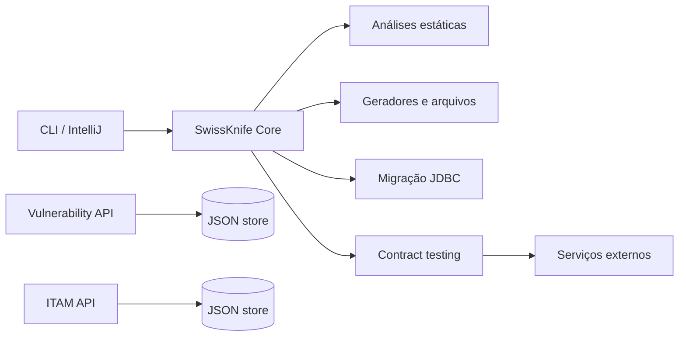

# Arquitetura

O SwissKnife Javanist usa uma arquitetura modular sem dependências obrigatórias.
Cada ferramenta possui um pacote próprio e é orquestrada por
`dev.swissknife.Main`.

## Fluxo

## Decisões

- Java 21 é o baseline; virtual threads atendem as APIs.
- O armazenamento JSON Lines usa troca atômica de arquivo e lock de leitura/escrita.
- Os servidores escutam somente no loopback e aceitam autenticação por token.
- A migração usa apenas JDBC, podendo receber qualquer driver no classpath.
- O plugin IntelliJ é um projeto isolado, pois depende do SDK da JetBrains.

## Limites conscientes

O analisador SQL e o parser DDL cobrem SQL portável. Dialetos proprietários podem
exigir adaptação. Alterações destrutivas de schema são marcadas e nunca executadas
automaticamente.
